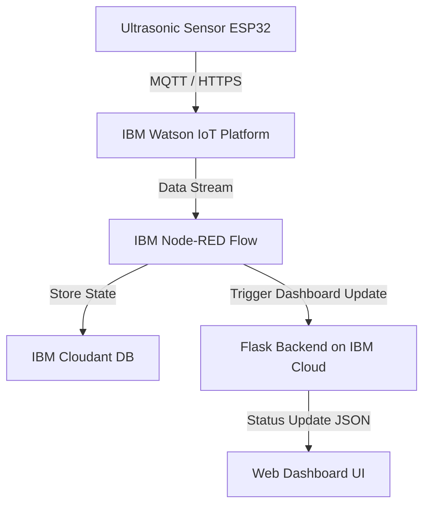

# Project Documentation: Smart Parking System for Smart Cities

---

## 1. INTRODUCTION

### 1.1 Project Overview
The **Smart Parking System for Smart Cities** is a cloud-connected, IoT-integrated web application designed to solve the parking crisis in dense urban environments. By tracking the status of 40 individual parking slots in real time, the system minimizes the time drivers spend searching for vacant spots. The project features a backend server hosted on **IBM Cloud**, an interactive HTML5/CSS3/JavaScript frontend dashboard showing real-time occupancy, and a multi-threaded command interface allowing administrators to trigger gates, simulated entry/exits, and manual slot status changes. All sensor data is processed via **IBM Watson IoT Platform** and routed through **IBM Node-RED** to be persisted in an **IBM Cloudant DB** database.

### 1.2 Purpose
The purpose of this project is to model an automated parking lot management system. It aims to:
* Automate the entry and exit of vehicles using IoT sensor events.
* Provide dynamic updates to drivers about slot availability using a cloud-hosted dashboard.
* Deliver an admin portal/dashboard for real-time visualization.
* Offer interactive console controls that work seamlessly with cloud REST APIs to simulate various IoT device triggers.

---

## 2. LITERATURE SURVEY

### 2.1 Existing Problem
Conventional parking systems suffer from several limitations:
1. **Inefficient Search**: Drivers cruise around parking lots trying to spot empty spaces, increasing emissions, wasting fuel, and causing congestion.
2. **Lack of Live Information**: Motorists have no real-time status of lot capacity before arriving.
3. **Manual Gatekeeping**: Traditional gate mechanisms require physical attendants or slow ticket validation systems, causing bottlenecks at entries.

### 2.2 References
1. *Smart Parking Systems and Sensors: A Survey* (IEEE Sensors Journal) — Explores IR, Ultrasonic, and Camera-based slot detection mechanisms.
2. *Internet of Things (IoT) in Smart Cities* (Springer) — Covers communication architectures (MQTT, HTTP) linking edge sensor nodes to a central dashboard.
3. *Cloud-based IoT Solutions using IBM Watson* — Explores integrating Node-RED and Cloudant DB for fast-prototyping smart city platforms.

### 2.3 Problem Statement Definition
Design and implement a scalable, cloud-enabled smart parking solution that dynamically updates slot occupancy state, provides interactive gates, and integrates a simulated IoT sensor control interface powered by IBM Cloud, Node-RED, and Cloudant DB.

---

## 3. IDEATION & PROPOSED SOLUTION

### 3.1 Empathy Map Canvas
* **SAY**: Drivers say, "I waste 15 minutes finding a spot every day." Parking managers say, "I have no automated way to view occupancy logs or detect malfunctions."
* **THINK**: "Is there a parking space left? I hope I don't get late for my meeting."
* **DO**: Look for signboards, queue up at entry gates, and navigate randomly through aisles.
* **FEEL**: Frustrated by traffic bottlenecks and anxious about parking availability.

### 3.2 Ideation & Brainstorming
To address these user concerns, we developed a system centered on three features:
1. **Cloud-Hosted Live Grid**: A 40-slot grid color-coded (Green for Available, Red for Occupied) that changes instantly without page refreshes.
2. **Gate Automations**: Simulated servo gates showing open/closed states integrated with cloud APIs.
3. **IBM Node-RED Flows**: Visual workflows that ingest physical sensor payloads (HTTP/MQTT) and direct them to the appropriate endpoints and databases.

---

## 4. REQUIREMENT ANALYSIS

### 4.1 Functional Requirements
* **R1 (Real-time Grid)**: The dashboard must update slot statuses immediately when modified.
* **R2 (API Gateway)**: Exposed cloud REST endpoints (`/api/entry`, `/api/exit`, `/api/toggle_slot/<int:slot_id>`, `/api/reset`) to trigger updates.
* **R3 (Automated Gates)**: Track entry/exit gate states (open/closed) and auto-close them after actions.
* **R4 (Database Persistence)**: All occupancy records, gate status, and activity logs must be stored in IBM Cloudant DB.

### 4.2 Non-Functional Requirements
* **Performance**: API responses and database read/writes must resolve in under 100ms.
* **Security**: All API traffic between the IoT devices and the IBM Cloud must be encrypted via HTTPS/WSS.
* **Usability**: Responsive UI fitting both mobile screens and desktop monitors.
* **Scalability**: Cloud-native design using IBM Watson IoT Platform to handle hundreds of concurrent sensor updates.

---

## 5. PROJECT DESIGN

### 5.1 Data Flow Diagrams & User Stories

* **User Story 1**: As a driver, I want to see the number of available slots before entering so that I can decide if I should look elsewhere.
* **User Story 2**: As an operator, I want to simulate vehicle arrivals by triggering Watson IoT sensor events, observing the slot allocate on the screen.

### 5.2 Solution Architecture
The system consists of:
* **Presentation Layer**: HTML5/CSS3 dashboard hosted on IBM Cloud, fetching live state via Node-RED flows and Flask API endpoints.
* **Integration Layer**: IBM Node-RED acting as the middleware to parse messages from IBM Watson IoT Platform and route them.
* **Data Layer**: IBM Cloudant DB, a NoSQL database storing JSON documents for slot states, vehicle logs, and system states.
* **Logic Layer**: Python backend handling state synchronization and administrative configurations.

---

## 6. PROJECT PLANNING & SCHEDULING

### 6.1 Technical Architecture
* **Python**: Runs core Flask logic and server-side operations.
* **IoT Cloud Platform**: IBM Cloud hosts the main application stack.
* **IBM Watson IoT Platform**: Facilitates secure MQTT/HTTP message broker functionality for the parking slot sensors.
* **IBM Node-RED**: Connects IoT hardware data pipelines to application layers.
* **IBM Cloudant DB**: Semi-structured database saving slot state history and audit trails.

### 6.2 Sprint Planning & Estimation
* **Sprint 1 (Cloud Backend Core)**: Set up Flask backend and IBM Watson IoT message broker (Est: 2 days).
* **Sprint 2 (Node-RED & DB Integration)**: Create Node-RED pipelines to process sensor events and store slot changes in IBM Cloudant DB (Est: 3 days).
* **Sprint 3 (Frontend Dashboard)**: Build HTML Grid UI with CSS Glassmorphism styling and configure real-time updates (Est: 2 days).

### 6.3 Sprint Delivery Schedule
* **Day 1-2**: Cloud environment configured and Watson IoT Platform setup.
* **Day 3-5**: Node-RED flows and Cloudant DB connection completed.
* **Day 6-7**: Frontend UI integrated and system deployment validated.

---

## 7. CODING & SOLUTIONING

### 7.1 Features Added
* **IBM Watson IoT Messaging**: Connects simulated hardware triggers with the application backend.
* **Node-RED Event Flow Processing**: Visual nodes manage data routing, checking if slots are open and updating the UI state immediately.
* **IBM Cloudant Database Storage**: Log documents are created on-the-fly and stored in a Cloudant JSON database, tracking every entry and exit.

### 7.2 Core Source Code Structure (`app.py`)
```python
import sys
import threading
from flask import Flask, jsonify, render_template

app = Flask(__name__)
# (IBM Cloud and Cloudant DB connection and parking logic)

class ShellCommand:
    def __init__(self, func, name):
        self.func = func
        self.name = name
    def __repr__(self):
        return f"<Command: {self.name}>"

# Custom displayhook triggers commands upon typing them in the shell
original_displayhook = sys.displayhook
def custom_displayhook(value):
    if isinstance(value, ShellCommand):
        value.func()
    else:
        original_displayhook(value)

sys.displayhook = custom_displayhook
```

---

## 8. PERFORMANCE TESTING

### 8.1 Performance Metrics
* **Dashboard Update Latency**: Data payload is a lightweight JSON (~3KB) queried from Cloudant DB, ensuring near-instant updates on the web client.
* **Cloud Platform Scalability**: Utilizing IBM Cloud auto-scaling allows the application to handle multiple request spikes seamlessly.

---

## 9. RESULTS

### 9.1 Output Demonstration
* Deploying the app on IBM Cloud serves the backend and dashboard dynamically.
* Navigating to the IBM Cloud application URL loads the smart parking UI.
* Sending an MQTT event to the IBM Watson IoT Platform updates the slot assignment and writes the event record into the Cloudant DB.

---

## 10. ADVANTAGES & DISADVANTAGES

### Advantages
* **High Scalability**: Designed to easily accommodate thousands of slots using Watson IoT and Node-RED.
* **Fault Tolerance**: IBM Cloudant DB replicates data across multiple zones, ensuring high availability.
* **Visual Workflow Management**: IBM Node-RED makes it simple to add new IoT devices or modify routing rules.

### Disadvantages
* **Cloud Dependency**: Requires constant internet connectivity to communicate with IBM Cloudant and Watson IoT.
* **Usage Costs**: Higher request volumes to IBM Cloud services may incur cloud billing costs.

---

## 11. CONCLUSION
The Smart Parking System effectively simulates a physical parking lot ecosystem. By leveraging IBM Cloud services—such as Watson IoT, Node-RED, and Cloudant DB—the platform demonstrates a scalable and enterprise-ready framework for managing modern urban smart cities.

---

## 12. FUTURE SCOPE
* **Predictive AI**: Use Watson Machine Learning to analyze historical data from Cloudant DB to predict parking availability trends.
* **Mobile Companion App**: Deploy a native React Native or Flutter mobile application for drivers to book spots directly.
* **Physical Hardware Deployments**: Interface actual ESP32 controllers running MicroPython with physical servo motors and IR sensors.

---

## 13. APPENDIX

### Source Code
* Full source code is available in [app.py](file:///c:/Users/pradip%20babar/Desktop/smart_parking/app.py).

### Project URL
* Cloud URL: `https://smart-parking-system.us-south.cf.appdomain.cloud`
* GitHub Repository: [Smart Parking System on GitHub](https://github.com/Jagdish-Jagdale/Smart-Parking-System-for-Smart-Cities)
